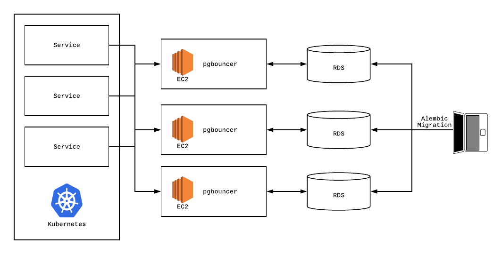
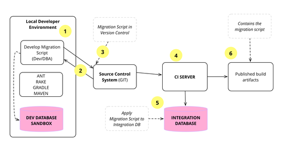

DB Migrations at CICDs
==================


Flow of dev to artifacts with DB schema changes
==============


* ANT - SQL Interface 

```
<sql rdbms="oracle"
     userid="xxx"
     password="xxx"
     driver="oracle.jdbc.OracleDriver"
     url="jdbc:oracle:thin:@xxx:xx:xx"
     xxx
   <transaction src="create_package.sql"/>
</sql> 

```

* GRADLE - JVM based build tool

```
repositories {
    mavenCentral()
}

dependencies {
    implementation(project(":producer"))

    
    runtimeOnly(project(":producer")) {
        capabilities {
            requireCapability("org.gradle.demo:producer-mysql-support")
        }
    }
    runtimeOnly(project(":producer")) {
        capabilities {
            requireCapability("org.gradle.demo:producer-postgres-support")
        }
    }
}
```
MAVEN - For build automation

```
<project xmlns="http://maven.apache.org/POM/4.0.0"   
xmlns:xsi="http://www.w3.org/2001/XMLSchema-instance"  
  xsi:schemaLocation="http://maven.apache.org/POM/4.0.0   
http://maven.apache.org/xsd/maven-4.0.0.xsd">  
  
  <modelVersion>4.0.0</modelVersion>  
  <groupId>com.javatpoint.application1</groupId>  
  <artifactId>my-app</artifactId>  
  <version>1</version>  
  
</project>  
```