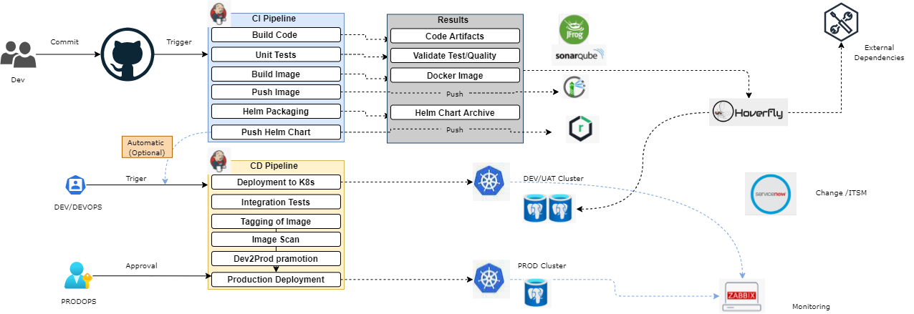

Sample of microservices CICD with containers

----------------------------------------

Tool sets
==

* Version control : GIT & GIT HUB.
* Unit Tests : Pytest / Junit Plugin.
* SAST: Bandit security plugin.
* Quality checks : SonaQube (Quality/Green IT/OpenAPI).
* Artifactory - Code : JFrog.
* Helm templates - Nexus & Harbour Registrary.
* Deployment : Helm / ArgoCD/ XLDeploy.
* Smoke / Integration - Pytest/Robot.
* Infra smoke - Helm tests.
* Monitoring : Zabbix.
* ITSM : Service Now.
* Service Virtualization : Hoverfly.
* DB/Schema : PostgresSQL
* Config as code (external - puppet)
* Secrets as a code (Hashicorp vault plugin)

