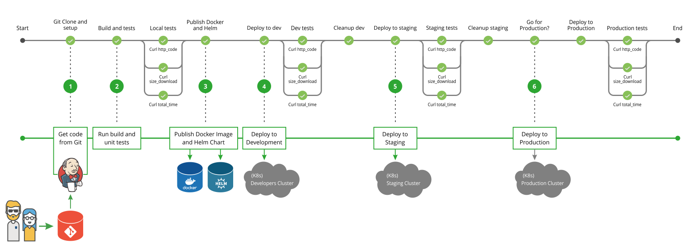

Sample -1 # Microservices deployment with HELM & Kubernetets
----------------

Technical details 

- Version control : GIT 
- Pipeline Orchestration : Jenkins Declarative model.
- Test (Unit/Integrations)
- Stages : DEV /UAT / PRD 
- Deployment : HELM 
- Infra : Kubernetes 
- Security - Static / sonar and bandit
- Monitoring : External.